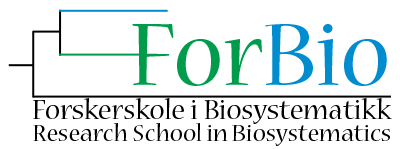
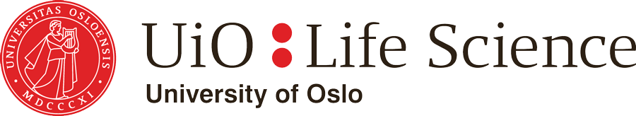

# Welcome to CompPhylo 2019 - Oslo Edition

Sponsored by [Forskerskole i biosystematikk (ForBio)](https://www.forbio.uio.no/) & [UiO:Life Science](https://www.uio.no/english/research/strategic-research-areas/life-science/)  

ForBio and UiO:Life Science jointly offer a generator workshop on model-based demographic inferences of both single species and communities. The workshop aims to learn and apply new tools to elucidate phylogeographic patterns, biogeographic shifts and demographic responses of single- and multi-taxa as well as to contribute to knowledge exchange on methodological challenges and diverse biological systems for this cutting-edge field of research.

August 26-30, 2019  
[Tollboden, Drobak Marine Station](https://goo.gl/maps/6UamJ4Bnog92)  
Biologveien 2  
1440 Drobak  
Norway  

## Organisers
  - [Hugo de Boer](hugo.deboer@nhm.uio.no) (ForBio)
  - [Marie Leys](marie.leys@ibv.uio.no) (University of Oslo)

## Instructors, and Facilitators
  - Mike Hickerson (City College of New York)
  - Marcelo Gehara (American Museum of Natural History)
  - Champak Beeravolu Reddy (University of Fribourg)
  - Alexander Xue (Cold Spring Harbor Laboratory)
  - Isaac Overcast (Graduate Center, City University of New York)

# Registration

Register in the submission form with a short CV and indicate the nature and 
stage of your interest or research project(s). Registration deadline is May 
1st, 2019. We will select those of you whom are most likely to benefit from 
this course, should the maximum number of participants be exceeded. Contact 
Marie Leys for more information about the workshop.

[Register for CompPhylo 2019 Oslo](https://skjema.uio.no/109922)

## Fee
No course fee

## Travel, food and accommodation
Shared accommodation is free of charge. Food is included, and the station 
has cooking facilities and participants will prepare food together in shifts. 
In addition, ForBio will cover travel for Norwegian ForBio members.

# Schedule

Times            | Sunday | Monday | Tuesday | Wednesday | Thursday | Friday |
-----            | ------ | ------ | ------ | | ------- | ------ | ------ |
8:30-9:00       | | | Check-in and refreshments | Check-in and refreshments | Check-in and refreshments | watdo|
9:00-12:30      | | | Intro to RAD-Seq data types | (Instruction) [Jupyter notebook setup](Jupyter_Notebook_Setup.md), [Tetrad - A Quartet-based species tree method](https://nbviewer.jupyter.org/github/dereneaton/ipyrad/blob/master/tests/cookbook-tetrad.ipynb), & [Phylogenetic inference: RAxML](06_RAxML_API.md) | (Instruction) [Clustering analysis: PCA](04_PCA_API.md), Demographic analysis ([momi2](07_momi2_API.md)) | friday morn |
12:30-14:00 | | | Lunch | Lunch | Lunch | Lunch |
14:00-17:00 | | | [Cluster basics](01_cluster_basics.md) and [ipyrad parts I](02_ipyrad_partI_CLI.md) & [II](03_ipyrad_partII_CLI.md) | (Small Group work) [Targeted phylogenetics exercises](tba.md) | (Small Group work) [Targeted population genetics exercises](tba.md) | Friday afternoon |

## Additional resources

# CompPhylo Oslo 2019 co-sponsored by:

## CompPhylo Oslo 2019 Group Photo

Don't forget to get a nice group photo!
